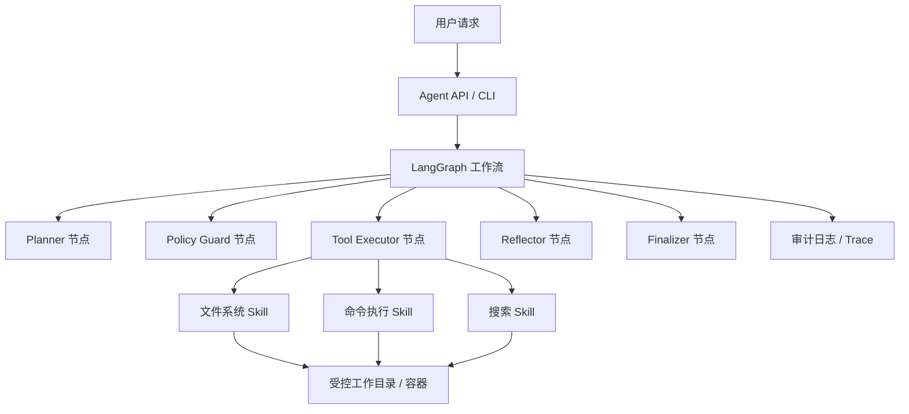
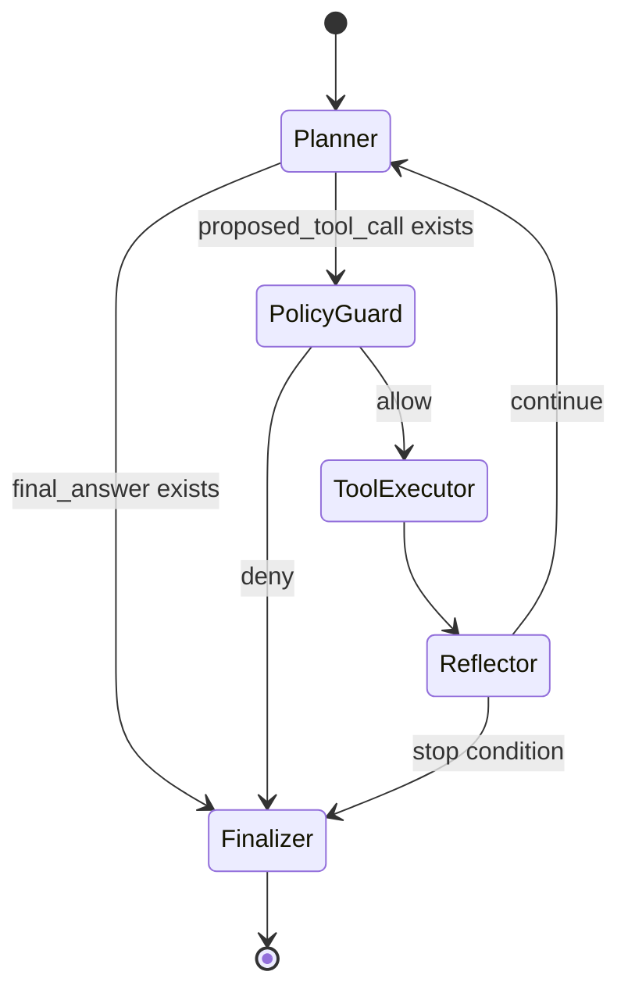

# 基于 LangGraph 的 Linux Agent 原型设计

## 1. 背景与目标

本设计面向一个基于 LangGraph 的 Agent 原型。该 Agent 能在受控 Linux 环境中自主完成基础运维与开发类任务，包括读取文件系统、浏览目录、检索文件、执行 Linux 命令、观察结果并迭代决策，并为后续带审批的受控写入保留扩展位。

原型目标不是让 Agent 获得无限制 shell 权限，而是在可审计、可限制、可中断的执行框架内验证以下能力：

- 将用户目标拆解为可执行步骤。
- 根据当前状态选择文件系统工具或命令执行工具。
- 读取命令输出、错误信息和文件内容后继续推理。
- 对高风险操作触发人工确认或策略拒绝。
- 记录完整行动轨迹，便于调试、复盘和安全审计。

> 当前仓库已完整覆盖第一阶段只读能力，并已落地第二阶段的核心执行链路：命令执行配置、命令策略解析、`run_command` skill、graph 集成、命令审计与 verbose 输出、以及命令结果驱动的 Reflector / Finalizer 总结。默认仍使用 `deepseek-v4-pro`，通过 OpenAI 兼容接口接入 `https://api.deepseek.com`。第三阶段中，写 skill、审批暂停/恢复、写操作审计、备份 manifest、写后验证、验证失败自动回滚与 CLI 级恢复/回滚链路均已落地。

### 1.1 当前阶段 2 实现边界（2026-05-10）

- 已实现：`list_dir`、`read_file`、`search_text`、`run_command`、命令审计日志、verbose 命令明细、命令结果驱动的后续诊断。
- 已完成的阶段 2 验收场景包括：失败测试诊断、类型检查失败总结、命令失败后的文件回读与下一步建议。
- 当前仍不支持：任意 shell 语法、交互式命令、后台常驻进程、联网下载或安装依赖。
- `apply_patch` / `write_file` 已接入 graph，并通过审批暂停 / 恢复链路受控执行。
- CLI 已支持 `--resume-run <run_id> --approve|--reject` 和 `--rollback-run <run_id>`。
- 审计日志已补充 `approval_requested`、`write_applied`、`write_rollback`。
- 成功写入后，Planner / Reflector 会强制要求一次验证命令；未验证写入不会被当作成功完成。
- 当验证命令失败且 `auto_rollback_on_verify_failure=true` 时，graph 会自动基于 manifest 执行回滚，并把结果写入最终回答与审计日志。

### 1.2 当前阶段 3 已落地能力（2026-05-10）

- `AgentState` 已支持 `risk_decision = "needs_approval"` 与 `pending_approval`，可以表达“等待审批”的中间结果。
- `AgentState` 已支持 `resume_action`，可从持久化审批状态恢复执行。
- `AgentConfig` 已新增 `write_requires_approval`、`max_patch_bytes`、`max_patch_hunks`、`backup_dir`、`auto_rollback_on_verify_failure`。
- `policy.py` 已能对 `write_file` / `apply_patch` 给出 `needs_approval` 或 `deny`，并生成结构化审批理由、影响摘要和备份计划。
- `skills/write.py` 已实现 `apply_patch` 与 `write_file`：前者支持 `Add File` / `Update File` 的 dry-run 校验、备份、manifest 与原子写入，后者支持 `create_only`、`append`、`overwrite` 三种受限模式，并共享回滚记录。
- `graph.py` 已支持审批暂停、批准恢复到 `tool_executor`、拒绝终止，以及写操作专用审计事件。
- `app.py` 已支持退出码 `2` 的审批暂停提示、`--resume-run <run_id> --approve|--reject`、以及 `--rollback-run <run_id>`。
- `graph.py` 已支持写后必须验证的 Planner / Reflector 闭环；验证失败时可自动回滚，并在 finalizer 中总结验证与回滚结果。
- 当前仍未实现：更复杂的多轮修复策略、验证命令自动推荐优化，以及更细粒度的回滚策略选择。

## 2. 范围与非目标

### 2.1 范围

- 基于 LangGraph 构建有状态 Agent 工作流。
- 提供基础 Linux skill：目录浏览、文件读取、文本搜索、命令执行，并在后续阶段补充带审批的写操作。
- 支持任务计划、工具调用、结果观察、错误恢复和终止判断。
- 支持命令超时、输出截断、工作目录限制和审计日志。
- 支持可配置的安全策略，包括路径边界、命令 allowlist/denylist、危险操作审批。

### 2.2 非目标

- 不在原型阶段提供无边界 root 权限。
- 不实现长期自我复制、自启动服务或后台驻留行为。
- 不默认执行破坏性命令，例如 `rm -rf`、磁盘格式化、权限批量修改、网络扫描等。
- 不把 Agent 设计为绕过系统权限、提权或隐藏行为的工具。

## 3. 总体架构

系统由四层组成：用户接口层、LangGraph 编排层、工具与 skill 层、执行隔离层。



### 3.1 用户接口层

原型可以先提供 CLI 或简单 HTTP API：

- CLI：适合本地快速验证，如 `python -m linux_agent "检查项目结构并运行测试"`。
- HTTP API：适合集成 Web UI 或其他系统，如 `POST /runs` 创建任务。

接口层只负责接收目标、传入运行配置、展示最终结果和运行日志，不直接执行系统操作。

### 3.2 LangGraph 编排层

LangGraph 负责把 Agent 建模为显式状态机。每个节点只承担一个职责：计划、策略检查、工具执行、反思、完成判断。

### 3.3 工具与 skill 层

工具层把 Linux 能力包装为结构化工具，所有工具都必须：

- 使用明确的输入 schema。
- 返回结构化结果，而不是只返回字符串。
- 记录调用参数、耗时、退出码和错误。
- 在执行前经过策略检查。

### 3.4 执行隔离层

原型建议默认运行在非 root 用户、受控工作目录或容器内。关键隔离策略包括：

- 限制 Agent 可访问的根路径，例如 `/workspace`。
- 禁止访问敏感路径，例如 `/etc/shadow`、`/root`、`~/.ssh`。
- 对命令设置超时和最大输出大小。
- 默认关闭或限制网络访问。
- 将高风险命令转为人工确认流程。

## 4. LangGraph 状态设计

Agent 的核心状态建议使用 `TypedDict` 或 Pydantic model 表达。

```python
from typing import Literal, TypedDict

class ToolCall(TypedDict):
    name: str
    args: dict
    risk_level: Literal["low", "medium", "high"]

class Observation(TypedDict):
    tool: str
    ok: bool
    stdout: str | None
    stderr: str | None
    exit_code: int | None
    artifact_paths: list[str]

class AgentState(TypedDict):
    run_id: str
    user_goal: str
    workspace_root: str
  messages: list[BaseMessage]
    plan: list[str]
    current_step: str | None
    proposed_tool_call: ToolCall | None
    observations: list[Observation]
  risk_decision: Literal["allow", "deny"] | None
    iteration_count: int
  consecutive_failures: int
    final_answer: str | None
```

关键字段说明：

- `workspace_root`：工具可访问的根目录，所有路径都必须解析到该目录内部。
- `plan`：由 Planner 生成，可随着观察结果更新。
- `proposed_tool_call`：下一步候选工具调用，由 Policy Guard 检查。
- `observations`：工具执行结果，是 Agent 反思和后续行动的依据。
- `iteration_count`：防止无限循环。

## 5. 图节点设计

### 5.1 Planner 节点

职责：理解用户目标，生成或更新计划，并通过模型原生 tool calling 决定是否提出下一次工具调用。

输入：`user_goal`、历史消息、当前计划、历史观察。

输出：`plan`、`current_step`、`proposed_tool_call` 或 `final_answer`。

典型行为：

- 通过 OpenAI 兼容的聊天模型绑定 `list_dir`、`read_file`、`search_text` 三个工具 schema。
- 先用 `list_dir` 或 `search_text` 建立上下文。
- 对不确定信息优先观察，而不是臆测。
- 对复杂任务拆分为小步骤。
- 如果任务已经满足，设置 `final_answer`。

### 5.2 Policy Guard 节点

职责：在工具真正执行前检查风险。

检查项：

- 路径是否在 `workspace_root` 内。
- 命令是否命中 denylist。
- 是否包含重定向、管道、后台执行、权限修改、删除、网络访问等高风险模式。
- 是否超过用户或系统配置的权限范围。

输出：`risk_decision`。

当前阶段决策规则：

- `allow`：低风险只读工具调用。
- `deny`：非只读工具、路径越界、命中敏感路径的请求。

### 5.3 Tool Executor 节点

职责：执行经过允许的工具调用，并返回结构化观察。

执行要求：

- 根据 `proposed_tool_call["name"]` 分发到只读 skill。
- 将工具结果写回 `Observation`，并同步追加 `ToolMessage` 供下一轮 Planner 继续对话。
- 输出过长时截断并提示截断。

### 5.4 Reflector 节点

职责：根据工具结果判断下一步。

典型行为：

- 命令失败时读取错误并尝试低风险修正。
- 文件不存在时搜索候选路径。
- 重复失败达到阈值时停止并向用户报告。
- 发现需要高风险操作时请求确认。

### 5.5 Finalizer 节点

职责：生成最终响应。

最终响应应包含：

- 已完成的操作。
- 关键观察结果。
- 变更文件列表或执行命令摘要。
- 未完成事项和原因。

## 6. 图流转设计

推荐的 LangGraph 流程如下：



停止条件：

- 已满足用户目标。
- 达到最大迭代次数。
- 连续失败超过阈值。
- 策略拒绝且没有安全替代方案。
- 等待人工确认。

## 7. Skill 设计

### 7.1 文件系统 Skill

#### `list_dir`

用途：列出受控目录内容。

输入：

```json
{
  "path": "src",
  "recursive": false,
  "max_entries": 200
}
```

输出：

```json
{
  "ok": true,
  "entries": [
    {"path": "src/main.py", "type": "file", "size": 1200}
  ]
}
```

安全策略：路径必须位于 `workspace_root` 内，默认不递归遍历隐藏目录和大型目录。

#### `read_file`

用途：读取文本文件的指定范围。

输入：

```json
{
  "path": "README.md",
  "start_line": 1,
  "end_line": 120
}
```

安全策略：限制单次读取大小，拒绝二进制文件和敏感文件。

#### `write_file`

用途：创建或覆盖受控路径下的文件。

输入：

```json
{
  "path": "notes/result.md",
  "content": "...",
  "mode": "create_only"
}
```

安全策略：默认需要审批；当前实现支持 `create_only`、`append`、`overwrite`，其中已有文件修改仍优先推荐走 `apply_patch`，而不是直接覆盖整文件。

#### `apply_patch`

用途：对文本文件应用 diff。

安全策略：比直接覆盖更适合代码修改，因为可审计、可回滚、变更范围清晰。当前实现支持仓库内部 `*** Begin Patch` 风格的 `Add File` / `Update File`，并在真正写入前完成 dry-run 匹配校验。

### 7.2 搜索 Skill

#### `search_text`

用途：在受控目录内搜索文本。

实现建议：优先使用 ripgrep。

输入：

```json
{
  "query": "TODO|FIXME",
  "path": ".",
  "glob": "**/*.py",
  "max_results": 100
}
```

安全策略：限制结果数量和单条上下文长度。

### 7.3 命令执行 Skill

#### `run_command`

用途：执行受控 Linux 命令。

输入：

```json
{
  "command": "pytest -q",
  "cwd": ".",
  "timeout_seconds": 120,
  "env": {}
}
```

输出：

```json
{
  "ok": false,
  "exit_code": 1,
  "stdout": "...",
  "stderr": "...",
  "duration_ms": 3812,
  "truncated": false
}
```

安全策略：

- 使用 `subprocess.run(..., shell=False)` 执行参数化命令，或使用 shell 解析器将命令拆分后检查。
- 原型阶段可限制为常见开发命令：`ls`、`pwd`、`cat`、`sed`、`rg`、`find`、`python`、`pip`、`pytest`、`node`、`npm test`、`git status` 等。
- 拒绝或审批：`sudo`、`su`、`chmod -R`、`chown -R`、`rm -rf`、`mkfs`、`dd`、后台执行、cron 修改、systemd 修改、SSH 私钥访问、任意网络扫描。
- 禁止命令逃逸到 `workspace_root` 之外。

## 8. 安全与权限模型

### 8.1 路径边界

所有路径进入工具前必须执行标准化：

1. 将相对路径拼接到 `workspace_root`。
2. 使用 `Path.resolve()` 解析符号链接。
3. 确认解析后的路径仍在 `workspace_root` 内。
4. 命中敏感路径规则时拒绝。

### 8.2 命令风险分级

| 等级 | 示例 | 处理方式 |
| --- | --- | --- |
| 低 | `pwd`、`ls`、`rg`、`pytest -q` | 自动允许 |
| 中 | `pip install`、`npm install`、写文件、删除单个临时文件 | 需要配置允许或人工确认 |
| 高 | `sudo`、`rm -rf`、`chmod -R`、访问密钥、修改系统服务 | 默认拒绝 |

### 8.3 人工确认

当策略返回 `needs_approval` 时，Agent 应暂停并展示：

- 准备执行的工具调用。
- 风险原因。
- 预期影响。
- 可替代的低风险方案。

只有用户确认后才继续执行。

### 8.4 审计日志

每次运行生成 `run_id`，记录：

- 用户目标。
- 每次计划更新。
- 每次工具调用参数。
- 策略决策及原因。
- 工具输出摘要。
- 文件变更 diff。
- 最终结果。

日志可写入 JSONL：

```json
{"run_id":"...","event":"tool_proposed","data":{"tool":"read_file","args":{"path":"README.md"}}}
```

## 9. 原型目录结构建议

```text
linux-agent/
  pyproject.toml
  README.md
  src/
    linux_agent/
      __init__.py
      app.py
      graph.py
      state.py
      policy.py
      skills/
        filesystem.py
        search.py
        shell.py
      audit.py
      config.py
  tests/
    test_policy.py
    test_filesystem_skill.py
    test_shell_skill.py
```

核心模块职责：

- `graph.py`：定义 LangGraph 节点和边。
- `state.py`：定义 `AgentState`、工具调用和观察结果 schema。
- `policy.py`：统一风险判断和审批决策。
- `skills/`：封装具体 Linux 能力。
- `audit.py`：记录运行轨迹。
- `config.py`：加载权限、超时、路径、命令策略。

## 10. 最小可行实现计划

### 阶段 1：只读观察型 Agent

- 实现 `list_dir`、`read_file`、`search_text`。
- 构建 LangGraph：`Planner -> PolicyGuard -> ToolExecutor -> Reflector -> Finalizer`。
- 限制路径在 `workspace_root` 内。
- 添加运行日志。

验收标准：Agent 可以回答“项目里有哪些文件”“某个函数在哪里定义”等问题。

### 阶段 2：受控命令执行

- 实现 `run_command`。
- 添加命令 allowlist/denylist。
- 添加超时、输出截断、退出码处理。
- 允许执行测试、lint、构建类命令。

验收标准：Agent 可以运行测试，读取失败信息，并给出下一步建议。

### 阶段 3：受控写操作

- 实现 `apply_patch` 或 `write_file`。
- 写操作默认进入审批流程。
- 记录 diff 和变更摘要。
- 增加失败回滚或备份策略。

验收标准：Agent 可以在用户确认后修改工作区文件，并运行测试验证。

> 阶段 2 / 阶段 3 的详细任务拆解见 `docs/phase2_phase3_detailed_tasks.md`。

### 阶段 4：增强自主性

- 引入计划更新和反思评分。
- 支持连续错误恢复。
- 支持任务预算：最大迭代次数、最大命令次数、最大运行时长。
- 支持更丰富的审批 UI。

验收标准：Agent 可以在有限预算内完成简单开发任务，并在风险升高时暂停。

## 11. LangGraph 伪代码

```python
from langgraph.graph import StateGraph, END

from linux_agent.state import AgentState
from linux_agent.nodes import planner, policy_guard, tool_executor, reflector, finalizer


def route_after_planner(state: AgentState) -> str:
    if state.get("final_answer"):
        return "finalizer"
    return "policy_guard"


def route_after_policy(state: AgentState) -> str:
    decision = state.get("risk_decision")
    if decision == "allow":
        return "tool_executor"
    if decision == "needs_approval":
        return "approval"
    return "reflector"


def route_after_reflector(state: AgentState) -> str:
    if state.get("final_answer"):
        return "finalizer"
    if state["iteration_count"] >= 12:
        return "finalizer"
    return "planner"


graph = StateGraph(AgentState)
graph.add_node("planner", planner)
graph.add_node("policy_guard", policy_guard)
graph.add_node("tool_executor", tool_executor)
graph.add_node("reflector", reflector)
graph.add_node("finalizer", finalizer)

graph.set_entry_point("planner")
graph.add_conditional_edges("planner", route_after_planner)
graph.add_conditional_edges("policy_guard", route_after_policy)
graph.add_edge("tool_executor", "reflector")
graph.add_conditional_edges("reflector", route_after_reflector)
graph.add_edge("finalizer", END)

app = graph.compile()
```

## 12. 策略检查伪代码

```python
from pathlib import Path

DENY_PATTERNS = [
    "sudo",
    "su ",
    "rm -rf",
    "mkfs",
    "dd if=",
    "chmod -R",
    "chown -R",
    "systemctl",
    "crontab",
]

SENSITIVE_PATH_PARTS = {
    ".ssh",
    ".gnupg",
    "shadow",
    "passwd-",
}


def resolve_safe_path(workspace_root: str, path: str) -> Path:
    root = Path(workspace_root).resolve()
    target = (root / path).resolve()
    if root != target and root not in target.parents:
        raise PermissionError("path escapes workspace root")
    if any(part in SENSITIVE_PATH_PARTS for part in target.parts):
        raise PermissionError("path matches sensitive path rule")
    return target


def classify_command(command: str) -> str:
    normalized = " ".join(command.strip().split())
    if any(pattern in normalized for pattern in DENY_PATTERNS):
        return "high"
    if any(token in normalized for token in ["pip install", "npm install", ">", "rm "]):
        return "medium"
    return "low"
```

## 13. 配置示例

```yaml
workspace_root: /workspace
max_iterations: 12
default_timeout_seconds: 60
max_output_bytes: 65536
network_enabled: false

commands:
  allow:
    - pwd
    - ls
    - rg
    - find
    - python
    - pytest
    - git status
  require_approval:
    - pip install
    - npm install
    - rm
    - chmod
  deny:
    - sudo
    - su
    - mkfs
    - dd
    - systemctl

paths:
  deny:
    - /root
    - /etc/shadow
    - ~/.ssh
    - ~/.gnupg
```

## 14. 测试策略

### 单元测试

- 路径逃逸测试：`../outside.txt` 必须拒绝。
- 符号链接逃逸测试：workspace 内 symlink 指向外部路径时必须拒绝。
- 命令风险分类测试：危险命令必须拒绝。
- 输出截断测试：超长 stdout 不应撑爆上下文。
- 超时测试：长时间命令必须被终止。

### 集成测试

- 给定一个临时 workspace，Agent 能列目录、读文件、搜索文本。
- Agent 能运行允许的测试命令并解析失败输出。
- 写操作在未审批时暂停。
- 审批通过后写入文件并记录 diff。

### 安全回归测试

- 访问 `/etc/shadow` 应拒绝。
- 执行 `sudo` 应拒绝。
- 执行 `rm -rf /` 应拒绝。
- 使用 symlink 绕过 workspace 应拒绝。

## 15. 风险与缓解

| 风险 | 缓解 |
| --- | --- |
| Agent 执行破坏性命令 | denylist、审批、非 root、容器隔离 |
| 路径穿越读取敏感文件 | `Path.resolve()`、workspace 边界检查、敏感路径规则 |
| 命令输出过大导致上下文膨胀 | 最大输出限制、摘要化、日志落盘 |
| 无限循环调用工具 | 最大迭代次数、失败阈值、运行时长预算 |
| LLM 幻觉工具结果 | 所有结论必须基于 observation，最终回答引用实际观察 |
| 供应链风险 | 安装依赖需审批，锁定依赖版本，隔离网络 |

## 16. 推荐默认策略

原型默认采用保守配置：

- 只允许访问指定 workspace。
- 只读工具自动允许。
- 测试、lint、构建命令自动允许。
- 写文件、安装依赖、删除文件需要确认。
- 提权、系统服务修改、敏感文件访问、破坏性磁盘操作直接拒绝。
- 所有工具调用都写入审计日志。

这样可以在保持 Agent 自主性的同时，让风险停留在可理解、可追踪、可回滚的范围内。

## 17. 后续扩展方向

- 增加长期记忆：记录项目结构、常用命令、历史失败原因。
- 增加多 Agent 协作：Planner、Executor、Reviewer 分工。
- 增加容器后端：每次任务创建短生命周期 sandbox。
- 增加 UI：展示计划、工具调用、审批请求和实时日志。
- 增加策略 DSL：让团队用配置声明允许的命令和路径。
- 增加任务回放：基于审计日志复现 Agent 决策过程。
