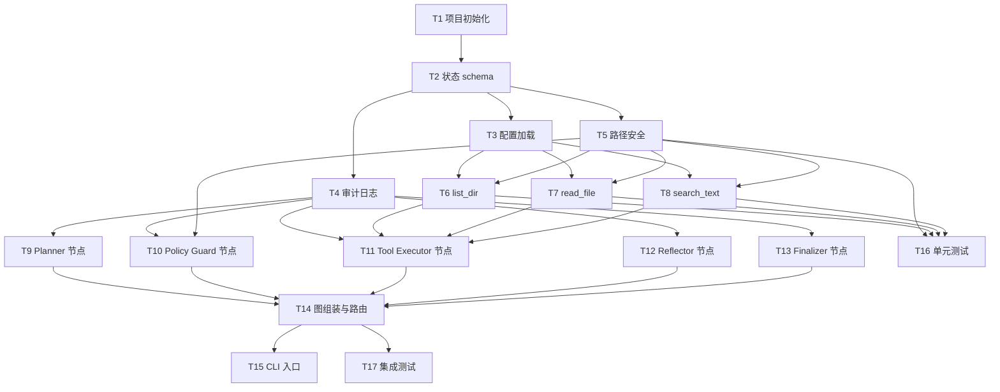

# 第一阶段任务详细拆解：只读观察型 Agent

> 对应设计文档：`langgraph_linux_agent_design.md` § 10 阶段 1

## 阶段目标

构建一个只读的 Linux Agent 原型，使其能够自主浏览文件系统、读取文件内容、搜索文本，并基于 LangGraph 状态机完成任务推理和结果汇报。不涉及任何写操作或命令执行。

**阶段验收标准**：Agent 可以回答"项目里有哪些文件"、"某个函数在哪里定义"、"README 里说了什么"等问题，过程可审计，结果有据可查。

**当前实现状态（2026-05-10）**：

- T1-T17 已完成并通过测试。
- 默认 LLM 为 `deepseek-v4-pro`，通过 OpenAI 兼容接口接入 `https://api.deepseek.com`。
- Planner 已切换为原生 tool calling，旧的 `PlannerDecision` / `llm_structured_output_method` 过渡层已移除。

---

## 任务总览

```
T1  项目初始化与依赖配置
T2  状态 schema 定义（state.py）
T3  配置加载（config.py）
T4  审计日志（audit.py）
T5  路径安全工具函数（policy.py）
T6  list_dir skill（skills/filesystem.py）
T7  read_file skill（skills/filesystem.py）
T8  search_text skill（skills/search.py）
T9  Planner 节点（graph.py）
T10 Policy Guard 节点（graph.py）
T11 Tool Executor 节点（graph.py）
T12 Reflector 节点（graph.py）
T13 Finalizer 节点（graph.py）
T14 图组装与路由（graph.py）
T15 CLI 入口（app.py）
T16 单元测试（tests/）
T17 集成测试（tests/）
```

依赖关系：T1 → T2 → T3/T4/T5 → T6/T7/T8 → T10/T11 → T9/T12/T13 → T14 → T15 → T16/T17

---

## T1 — 项目初始化与依赖配置

**文件**：`pyproject.toml`、`.python-version`（可选）

**任务内容**：

- 使用 `uv init` 或手写 `pyproject.toml` 初始化项目（包名 `linux_agent`）。
- 声明核心依赖：
  - `langgraph>=1.1`
  - `langchain>=1.2`
  - `langchain-core>=1.3`
  - `langchain-openai>=1.2`
  - `pydantic>=2.0`
  - `ripgrep`（系统级，通过 `which rg` 检测或 fallback 到 `grep`）
  - `PyYAML`（加载配置文件）
- 声明开发依赖：`pytest`、`pytest-asyncio`。
- 创建 `src/linux_agent/` 包目录结构（含空 `__init__.py`）。
- 验证：`uv run python -c "import langgraph; print(langgraph.__version__)"` 正常输出版本号。

**验收标准**：

- `pyproject.toml` 中包含完整依赖声明。
- `src/linux_agent/` 目录存在且可被 Python 识别为包。
- 可以在虚拟环境中成功导入 `langgraph`。

---

## T2 — 状态 schema 定义（state.py）

**文件**：`src/linux_agent/state.py`

**任务内容**：

根据设计文档第 4 节，使用 `TypedDict` 定义以下数据结构：

### `ToolCall`

```python
class ToolCall(TypedDict):
    name: str                              # 工具名：list_dir / read_file / search_text
    args: dict                             # 工具输入参数
    risk_level: Literal["low", "medium", "high"]
```

### `Observation`

```python
class Observation(TypedDict):
    tool: str                              # 调用的工具名
    ok: bool                               # 是否成功
    result: dict | None                    # 工具结构化返回值
    error: str | None                      # 错误描述（ok=False 时使用）
    duration_ms: int                       # 耗时
```

> 注：第一阶段不涉及命令执行，`stdout`/`stderr`/`exit_code` 暂不引入。

### `AgentState`

```python
class AgentState(TypedDict):
    run_id: str
    user_goal: str
    workspace_root: str
    messages: Annotated[list[dict], add_messages]   # LangGraph 消息累加器
    plan: list[str]
    current_step: str | None
    proposed_tool_call: ToolCall | None
    observations: list[Observation]
    risk_decision: Literal["allow", "deny"] | None  # 第一阶段不引入 needs_approval
    iteration_count: int
    consecutive_failures: int                       # 连续失败计数
    final_answer: str | None
```

**注意事项**：

- `messages` 字段使用 LangGraph 的 `add_messages` reducer，保证消息列表在图中可被正确合并。
- `consecutive_failures` 用于 Reflector 节点的失败熔断，第一阶段默认阈值为 3。
- 所有字段必须有类型注解，便于运行时验证。

**验收标准**：

- `from linux_agent.state import AgentState, ToolCall, Observation` 可正常导入。
- `AgentState` 的所有字段类型正确，有注释说明用途。
- `mypy` 或 `pyright` 对 `state.py` 无类型错误。

---

## T3 — 配置加载（config.py）

**文件**：`src/linux_agent/config.py`、`config.yaml`（示例）

**任务内容**：

- 定义 `AgentConfig` 数据类（使用 Pydantic `BaseModel` 或 `dataclass`）：

```python
class AgentConfig(BaseModel):
    workspace_root: Path
    max_iterations: int = 12
    max_consecutive_failures: int = 3
    max_read_bytes: int = 65536            # 单次读取上限
    max_search_results: int = 100
    max_list_entries: int = 200
  llm_model: str = "deepseek-v4-pro"
    llm_temperature: float = 0.0
  llm_base_url: str = "https://api.deepseek.com"
    sensitive_path_parts: list[str] = [".ssh", ".gnupg", "shadow", "passwd"]
    log_dir: Path = Path("logs")
```

- 提供 `load_config(path: str | None = None) -> AgentConfig` 函数：
  - 无参数时从环境变量 `LINUX_AGENT_WORKSPACE` 读取 `workspace_root`，其他字段使用默认值。
  - 有参数时从 YAML 文件加载并合并默认值。
  - 加载后立即验证 `workspace_root` 存在且是目录，否则抛出 `ValueError`。

- 提供示例配置文件 `config.yaml`（放在项目根目录）：

```yaml
workspace_root: ./workspace
max_iterations: 12
max_read_bytes: 65536
llm_model: deepseek-v4-pro
llm_base_url: https://api.deepseek.com
```

**验收标准**：

- `load_config()` 不传参时能正常加载，使用默认值。
- 传入不存在的 `workspace_root` 时抛出 `ValueError`。
- 所有字段均有合法默认值，不需要强制写配置文件即可运行。

---

## T4 — 审计日志（audit.py）

**文件**：`src/linux_agent/audit.py`

**任务内容**：

- 实现 `AuditLogger` 类，以 JSONL 格式写入 `logs/<run_id>.jsonl`。
- 每条日志记录一个事件，包含固定字段：

```python
class AuditEvent(TypedDict):
    run_id: str
    ts: str           # ISO 8601 时间戳
    event: str        # 事件类型（见下方枚举）
    data: dict        # 事件相关数据
```

- 需要记录的事件类型：

| 事件名 | 触发时机 | `data` 字段 |
| --- | --- | --- |
| `run_start` | Agent 启动时 | `user_goal`、`workspace_root`、`config` |
| `plan_update` | Planner 生成或更新计划 | `plan`、`current_step` |
| `tool_proposed` | Planner 提出工具调用 | `tool_call` |
| `policy_decision` | PolicyGuard 做出决策 | `decision`、`reason` |
| `tool_result` | ToolExecutor 执行完毕 | `tool`、`ok`、`duration_ms`、`error` |
| `reflector_action` | Reflector 判断下一步 | `action`、`reason` |
| `run_end` | Finalizer 完成 | `final_answer`、`iteration_count` |

- 提供便捷方法 `log(event: str, data: dict)` 和 `close()`。
- `log_dir` 不存在时自动创建。
- 文件以 UTF-8 编码写入，每行一个 JSON 对象（不使用换行内的 JSON 格式化）。

**验收标准**：

- 运行后 `logs/<run_id>.jsonl` 文件存在且每行可被 `json.loads()` 解析。
- 事件按时间顺序排列。
- `AuditLogger` 可作为上下文管理器使用（`with AuditLogger(...) as logger:`）。

---

## T5 — 路径安全工具函数（policy.py）

**文件**：`src/linux_agent/policy.py`

**任务内容**：

这是第一阶段最关键的安全层，所有工具在访问路径前都必须通过此模块的检查。

### `resolve_safe_path(workspace_root: str | Path, path: str) -> Path`

实现三步验证：

1. 将 `path` 拼接到 `workspace_root`，得到候选路径。
2. 调用 `.resolve()` 展开所有符号链接和 `..` 引用，获取绝对路径。
3. 验证解析后的路径以 `workspace_root.resolve()` 为前缀（包含相等情况），否则抛出 `PolicyViolation`。
4. 检查路径的每一个组成部分是否命中 `sensitive_path_parts`，命中则抛出 `PolicyViolation`。

```python
class PolicyViolation(Exception):
    def __init__(self, reason: str, path: str):
        self.reason = reason
        self.path = path
        super().__init__(f"Policy violation: {reason} (path={path})")
```

### `evaluate_tool_call(tool_call: ToolCall, config: AgentConfig) -> Literal["allow", "deny"]`

统一入口，第一阶段逻辑：

- 只允许 `list_dir`、`read_file`、`search_text`，其余全部 `deny`。
- 对有 `path` 参数的调用，使用 `resolve_safe_path` 检查（失败则 `deny`）。
- 返回 `"allow"` 时同时在日志中记录决策。

**注意事项**：

- 函数本身不捕获 `PolicyViolation`，由调用方（Policy Guard 节点）处理并记录。
- 符号链接攻击：`.resolve()` 必须在符号链接存在时才能正确展开，对不存在的路径要处理 `FileNotFoundError`（路径不存在时应允许，因为可能是搜索路径）。实际上只有在文件存在时才能 resolve symlink，可以做分支：存在则 resolve 后检查，不存在则字符串前缀检查。

**验收标准**：

- `../secret` 被拒绝。
- `/etc/shadow` 被拒绝（不在 workspace 内）。
- `src/main.py` 被允许（在 workspace 内）。
- workspace 内的符号链接指向 workspace 外部的路径被拒绝。
- `write_file` 工具调用被拒绝（非读类工具）。
- 全部有单元测试覆盖。

---

## T6 — `list_dir` Skill（skills/filesystem.py）

**文件**：`src/linux_agent/skills/filesystem.py`

**任务内容**：

实现 `list_dir(path: str, config: AgentConfig, recursive: bool = False, max_entries: int = 200) -> dict`。

**输入**（由 `proposed_tool_call.args` 传入）：

```python
{
  "path": "src",            # 相对于 workspace_root 的路径
  "recursive": false,
  "max_entries": 200
}
```

**输出**：

```python
{
  "ok": True,
  "path": "src",
  "entries": [
    {"name": "main.py", "path": "src/main.py", "type": "file",      "size": 1200},
    {"name": "utils",   "path": "src/utils",   "type": "directory", "size": None}
  ],
  "truncated": False,       # 若超过 max_entries 则为 True
  "total_visible": 5
}
```

**实现要求**：

- 调用 `resolve_safe_path` 验证目标路径。
- 使用 `os.scandir()` 遍历，对每个条目收集：`name`、`path`（相对 workspace_root）、`type`（file/directory/symlink）、`size`（文件大小，目录为 None）。
- 若 `recursive=True`，递归遍历子目录，但跳过以 `.` 开头的隐藏目录（如 `.git`）。
- 超过 `max_entries` 时截断并设 `truncated=True`，不报错。
- 目标路径不存在时返回 `{"ok": False, "error": "path not found"}`。
- 目标路径是文件而非目录时返回 `{"ok": False, "error": "not a directory"}`。

**验收标准**：

- 正常目录可列出条目。
- 超过限制时截断。
- 路径穿越被 `PolicyViolation` 阻止（由调用方处理）。
- 不存在的路径返回结构化错误，不抛出未捕获异常。

---

## T7 — `read_file` Skill（skills/filesystem.py）

**文件**：`src/linux_agent/skills/filesystem.py`

**任务内容**：

实现 `read_file(path: str, config: AgentConfig, start_line: int = 1, end_line: int | None = None) -> dict`。

**输入**：

```python
{
  "path": "README.md",
  "start_line": 1,
  "end_line": 80
}
```

**输出**：

```python
{
  "ok": True,
  "path": "README.md",
  "content": "# Project\n...",
  "start_line": 1,
  "end_line": 80,
  "total_lines": 240,
  "truncated": False       # 若内容超过 max_read_bytes 则截断
}
```

**实现要求**：

- 调用 `resolve_safe_path` 验证路径。
- 只允许读取文本文件；使用 `chardet` 或简单 `open(..., errors="replace")` 处理编码，遇到无法解码的字节替换为 `?` 而不是报错。
- 按行切片：先读入全部行，再返回 `start_line` 到 `end_line` 范围（1-based）。
- 返回内容不超过 `config.max_read_bytes` 字节；超出时截断并标记 `truncated=True`，同时告知 `total_lines`。
- 路径不存在时返回 `{"ok": False, "error": "file not found"}`。
- 目标是目录时返回 `{"ok": False, "error": "path is a directory"}`。
- `end_line` 超出实际行数时不报错，以实际末行为准。

**验收标准**：

- 正常文件可读取内容。
- 指定行范围可正确切片。
- 超过字节限制时截断，不丢失 `total_lines` 信息。
- 对含非 UTF-8 字符的文件不崩溃。
- 路径穿越被拒绝。

---

## T8 — `search_text` Skill（skills/search.py）

**文件**：`src/linux_agent/skills/search.py`

**任务内容**：

实现 `search_text(query: str, config: AgentConfig, path: str = ".", glob: str = "**/*", max_results: int = 100, context_lines: int = 2) -> dict`。

**输入**：

```python
{
  "query": "def resolve_safe_path",
  "path": "src",
  "glob": "**/*.py",
  "max_results": 50,
  "context_lines": 2
}
```

**输出**：

```python
{
  "ok": True,
  "query": "def resolve_safe_path",
  "matches": [
    {
      "file": "src/linux_agent/policy.py",
      "line_number": 14,
      "line": "def resolve_safe_path(workspace_root: str | Path, path: str) -> Path:",
      "context_before": ["", ""],
      "context_after": ["    root = Path(workspace_root).resolve()", ""]
    }
  ],
  "total_matches": 1,
  "truncated": False
}
```

**实现要求**：

- 优先使用 `ripgrep`（`rg`）；检测方式：`shutil.which("rg")`，不可用时 fallback 到 Python `re` 实现。
- ripgrep 调用：`rg --json -C {context_lines} -g '{glob}' -- '{query}' '{search_root}'`，解析 JSON 输出。
- **安全要求**：所有传入 ripgrep 的路径必须先经过 `resolve_safe_path` 验证；query 和 glob 不拼接到 shell 字符串（使用参数列表传入 `subprocess.run`，`shell=False`）。
- 结果超过 `max_results` 时截断。
- 单条 `line` 内容超过 200 字符时截断（避免长行撑爆上下文）。
- 搜索路径不存在时返回 `{"ok": False, "error": "search path not found"}`。
- 搜索无结果时返回 `{"ok": True, "matches": [], "total_matches": 0, "truncated": False}`。

**验收标准**：

- 能搜索到存在的关键词。
- ripgrep 不可用时 Python fallback 生效。
- 超过结果限制时截断。
- 路径穿越被拒绝。
- `subprocess.run` 使用参数列表，不使用 `shell=True`。

---

## T9 — Planner 节点（graph.py）

**文件**：`src/linux_agent/graph.py`

**任务内容**：

Planner 是 Agent 的推理核心，每次迭代都会调用 LLM，输出下一步计划并通过原生 tool calling 决定是否调用工具。

**节点签名**：`async def planner(state: AgentState, config: RunnableConfig) -> dict`

**系统提示设计要点**：

- 告知 Agent 当前 workspace 路径。
- 列出可用工具及其 schema：`list_dir`、`read_file`、`search_text`。
- 明确要求 Agent 在需要更多证据时直接发起 tool call。
- 约束一次最多调用一个工具；信息足够时直接输出纯文本最终答案。

**实现要求**：

- 从 `state["observations"]` 构建观察历史，拼入消息。
- 使用 `bind_tools` 将三个只读工具 schema 绑定到聊天模型。
- 若 LLM 返回 `AIMessage.tool_calls`，设置 `proposed_tool_call`，保留 provider 返回的 tool-call id，`risk_level` 默认为 `"low"`。
- 若 LLM 未返回 tool call，则将 assistant 文本视为 `final_answer`。
- 将原始 `AIMessage` 追加到 `state["messages"]`，后续由 `ToolMessage` 回填工具结果。
- 审计日志记录 `plan_update` 和 `tool_proposed` 事件。

**验收标准**：

- 给定用户目标后，Planner 能输出合法的 `proposed_tool_call` 或 `final_answer`。
- 当所有信息已足够时，Planner 能设置 `final_answer`。
- 模型返回空内容且没有 tool call 时不会崩溃，而是返回结构化失败说明。

---

## T10 — Policy Guard 节点（graph.py）

**文件**：`src/linux_agent/graph.py`

**任务内容**：

Policy Guard 在工具执行前做最后的风险检查，是安全的最后防线。

**节点签名**：`def policy_guard(state: AgentState, config: RunnableConfig) -> dict`

**实现要求**：

- 调用 `evaluate_tool_call(state["proposed_tool_call"], agent_config)` 获取决策。
- 更新 `state["risk_decision"]`。
- 审计日志记录 `policy_decision` 事件（包含工具、参数和决策）。
- 被拒绝时直接写入 `final_answer` 并路由到 Finalizer。
- 此节点本身不执行工具，不修改 `observations`。

**第一阶段简化**：

- 不引入 `needs_approval` 流程（第三阶段再实现）。
- 决策只有 `allow` 和 `deny` 两种。
- 拒绝时不执行工具，直接结束运行并返回安全策略拒绝说明。

**验收标准**：

- 读类工具调用返回 `allow`。
- 路径穿越调用返回 `deny`，并记录原因。
- 非读类工具调用返回 `deny`，并记录原因。

---

## T11 — Tool Executor 节点（graph.py）

**文件**：`src/linux_agent/graph.py`

**任务内容**：

Tool Executor 只在 `risk_decision == "allow"` 时才会被调用，负责分发并执行工具。

**节点签名**：`async def tool_executor(state: AgentState, config: RunnableConfig) -> dict`

**实现要求**：

- 根据 `proposed_tool_call["name"]` 分发到对应 skill 函数：
  - `list_dir` → `skills.filesystem.list_dir`
  - `read_file` → `skills.filesystem.read_file`
  - `search_text` → `skills.search.search_text`
- 记录调用开始时间，执行后计算 `duration_ms`。
- 捕获所有异常，构造 `Observation(ok=False, error=str(e))`。
- 成功时构造 `Observation(ok=True, result=<工具返回值>)`。
- 将 `Observation` 追加到 `state["observations"]`。
- 将工具结果以 `ToolMessage` 形式追加到 `state["messages"]`（便于 Planner 继续 tool-calling 对话）。
- 更新 `state["iteration_count"] += 1`。
- 清空 `state["proposed_tool_call"]`，避免旧请求残留到下一轮。
- 审计日志记录 `tool_result` 事件。

**验收标准**：

- 正常工具调用时 `observations` 新增一条成功记录。
- 工具内部报错时不崩溃，`observations` 新增一条失败记录。
- `iteration_count` 每次调用后递增。

---

## T12 — Reflector 节点（graph.py）

**文件**：`src/linux_agent/graph.py`

**任务内容**：

Reflector 负责分析最新观察结果，判断继续推理还是停止。不调用 LLM，是纯逻辑节点。

**节点签名**：`def reflector(state: AgentState, config: RunnableConfig) -> dict`

**实现逻辑**：

```
if risk_decision == "deny":
    consecutive_failures += 1
    往 messages 追加拒绝摘要
elif 最新 observation.ok == False:
    consecutive_failures += 1
    往 messages 追加失败摘要
else:
    consecutive_failures = 0

if consecutive_failures >= max_consecutive_failures:
    设置 final_answer = "任务因连续失败被终止，详见观察记录"

if iteration_count >= max_iterations:
    设置 final_answer = "已达最大迭代次数，当前进展：..."
```

- 将最新 Observation 的关键信息格式化后追加到 `messages`，供 Planner 下次读取。
- 不决定下一步调用哪个工具，只判断是继续还是终止。
- 审计日志记录 `reflector_action` 事件（`action` 字段为 `"continue"` 或 `"stop"`）。

**验收标准**：

- 连续失败 3 次后设置 `final_answer` 并终止。
- 达到最大迭代次数后设置 `final_answer` 并终止。
- 策略拒绝也算失败，计入连续失败计数。
- 成功观察后重置 `consecutive_failures`。

---

## T13 — Finalizer 节点（graph.py）

**文件**：`src/linux_agent/graph.py`

**任务内容**：

Finalizer 整合运行轨迹，生成用户可读的最终回答。

**节点签名**：`def finalizer(state: AgentState, config: RunnableConfig) -> dict`

**实现要求**：

- 若 `final_answer` 已由 Planner 设置，直接使用，追加观察摘要。
- 若由 Reflector 触发终止，生成说明性回答，包含：
  - 已完成的步骤（从 `plan` 中取）。
  - 完成的工具调用次数。
  - 停止原因。
- 格式化最终回答为 Markdown，便于展示。
- 审计日志记录 `run_end` 事件。
- 返回更新后的 `final_answer`。

**验收标准**：

- 无论何种终止原因，Finalizer 都能输出可读的最终答案。
- 最终答案包含已执行操作的摘要。

---

## T14 — 图组装与路由（graph.py）

**文件**：`src/linux_agent/graph.py`

**任务内容**：

用 LangGraph `StateGraph` 把所有节点连接成完整状态机。

**路由函数**：

```python
def route_after_planner(state: AgentState) -> Literal["finalizer", "policy_guard"]:
    if state.get("final_answer"):
        return "finalizer"
    return "policy_guard"

def route_after_policy(state: AgentState) -> Literal["tool_executor", "reflector"]:
    if state.get("risk_decision") == "allow":
        return "tool_executor"
    return "reflector"  # deny 时直接进入 reflector

def route_after_reflector(state: AgentState) -> Literal["finalizer", "planner"]:
    if state.get("final_answer"):
        return "finalizer"
    return "planner"
```

**图组装**：

```python
graph = StateGraph(AgentState)
graph.add_node("planner",      planner)
graph.add_node("policy_guard", policy_guard)
graph.add_node("tool_executor",tool_executor)
graph.add_node("reflector",    reflector)
graph.add_node("finalizer",    finalizer)

graph.set_entry_point("planner")
graph.add_conditional_edges("planner",      route_after_planner)
graph.add_conditional_edges("policy_guard", route_after_policy)
graph.add_edge("tool_executor", "reflector")
graph.add_conditional_edges("reflector",    route_after_reflector)
graph.add_edge("finalizer", END)

app = graph.compile()
```

- 暴露 `app` 供 CLI 和测试使用。
- 提供 `create_initial_state(goal: str, config: AgentConfig) -> AgentState` 工厂函数，生成带 `run_id` 的初始状态。

**验收标准**：

- `graph.compile()` 不报错。
- 可以用 `app.get_graph().draw_mermaid()` 输出图结构。
- 图结构与设计文档第 6 节的状态图吻合。

---

## T15 — CLI 入口（app.py）

**文件**：`src/linux_agent/app.py`

**任务内容**：

提供最简 CLI，支持一次性任务执行。

```bash
python -m linux_agent "列出 src 目录的所有文件并找到 main 函数定义在哪里"
python -m linux_agent --config config.yaml "项目里有没有 TODO 注释"
```

**实现要求**：

- 使用 `argparse` 解析参数：
  - 位置参数：`goal`（用户目标字符串）
  - `--config`：可选，YAML 配置文件路径
  - `--workspace`：可选，覆盖 `workspace_root`
  - `--verbose`：可选，打印每步推理过程
- 加载配置，创建初始状态，调用 `app.ainvoke(initial_state)`。
- 将最终 `final_answer` 打印到 stdout。
- 若 `--verbose`，同时打印每次迭代的工具调用和观察摘要。
- 错误时打印到 stderr 并以非零退出码退出。

**验收标准**：

- `python -m linux_agent "有哪些 Python 文件"` 能正常运行并输出结果。
- `--verbose` 模式可以看到每步操作。
- 配置错误时给出清晰错误提示。

---

## T16 — 单元测试（tests/）

**文件**：`tests/test_policy.py`、`tests/test_filesystem_skill.py`、`tests/test_search_skill.py`

**测试清单**：

### test_policy.py

| 测试用例 | 期望结果 |
| --- | --- |
| `resolve_safe_path(root, "src/main.py")` | 返回正确绝对路径 |
| `resolve_safe_path(root, "../etc/passwd")` | 抛出 `PolicyViolation` |
| `resolve_safe_path(root, "/etc/shadow")` | 抛出 `PolicyViolation` |
| `resolve_safe_path(root, ".ssh/id_rsa")` | 抛出 `PolicyViolation` |
| workspace 内 symlink 指向外部 | 抛出 `PolicyViolation` |
| `evaluate_tool_call` 传入 `read_file` | 返回 `"allow"` |
| `evaluate_tool_call` 传入 `write_file` | 返回 `"deny"` |

### test_filesystem_skill.py

| 测试用例 | 期望结果 |
| --- | --- |
| `list_dir` 正常目录 | 返回条目列表 |
| `list_dir` 超过 `max_entries` | 截断，`truncated=True` |
| `list_dir` 不存在的路径 | `ok=False`，含 `error` 字段 |
| `read_file` 读取已知文件 | 内容正确 |
| `read_file` 行范围切片 | 返回指定行 |
| `read_file` 超过字节限制 | 截断，含 `total_lines` |
| `read_file` 不存在的文件 | `ok=False` |

### test_search_skill.py

| 测试用例 | 期望结果 |
| --- | --- |
| `search_text` 搜索存在的关键词 | 返回匹配结果 |
| `search_text` 搜索不存在的关键词 | `matches=[]` |
| `search_text` 超过 `max_results` | 截断 |
| `search_text` 在子路径搜索 | 只返回该路径内的结果 |

**实现要求**：

- 使用 `tmp_path` fixture 创建临时工作区，不依赖真实文件系统。
- 测试相互独立，无状态共享。
- 使用 `pytest.raises` 验证异常。

**验收标准**：

- `pytest tests/` 全部通过，零失败。
- 路径安全相关测试全部覆盖（尤其是穿越和敏感路径）。

---

## T17 — 集成测试（tests/）

**文件**：`tests/test_integration.py`

**测试场景**：

> 使用 mock LLM（预设好固定的工具调用序列），不发起真实 API 请求。

### 场景 1：列目录

- 用户目标：`"列出 workspace 根目录的内容"`
- Mock LLM 第 1 次返回：调用 `list_dir(path=".")`
- Mock LLM 第 2 次返回：基于观察结果生成 `final_answer`
- 验证：`final_answer` 非空，`iteration_count == 1`，`observations` 有一条成功记录。

### 场景 2：读取文件

- 用户目标：`"读取 README.md 的内容"`
- Mock LLM 返回：调用 `read_file(path="README.md")` → `final_answer`
- 验证：观察结果中 `ok=True`，`content` 包含 README 内容。

### 场景 3：搜索关键词

- 用户目标：`"找到定义 main 函数的文件"`
- Mock LLM 返回：调用 `search_text(query="def main")` → `final_answer`
- 验证：`matches` 非空（workspace 中预置含 `def main` 的 Python 文件）。

### 场景 4：安全拦截

- Mock LLM 返回：调用 `write_file(path="output.txt")`（不在允许范围内）
- 验证：`risk_decision == "deny"`，Reflector 增加 `consecutive_failures`，最终 `final_answer` 包含失败说明。

### 场景 5：达到迭代上限

- `max_iterations = 3`
- Mock LLM 始终返回新的 `list_dir` 调用（模拟无终止）
- 验证：`iteration_count == 3`，`final_answer` 包含"已达最大迭代次数"说明。

**验收标准**：

- 所有场景通过，不发起真实 LLM API 调用。
- 安全拦截和迭代上限场景验证熔断机制有效。

---

## 任务依赖图



---

## 推荐实施顺序

建议按以下批次并行推进：

| 批次 | 任务 | 说明 |
| --- | --- | --- |
| 第 1 批 | T1 | 基础环境，阻塞一切后续工作 |
| 第 2 批 | T2、T3、T4、T5 | 基础模块，可同时开发 |
| 第 3 批 | T6、T7、T8 | Skill 实现，依赖 T3/T5，可同时开发 |
| 第 4 批 | T10、T11 | 策略和执行节点，依赖 T4/T5/Skills |
| 第 5 批 | T9、T12、T13 | Planner/Reflector/Finalizer |
| 第 6 批 | T14 | 图组装，依赖全部节点 |
| 第 7 批 | T15 | CLI 入口 |
| 第 8 批 | T16、T17 | 测试，可与 T6-T15 交错进行 |
